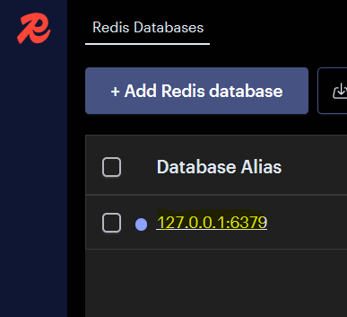
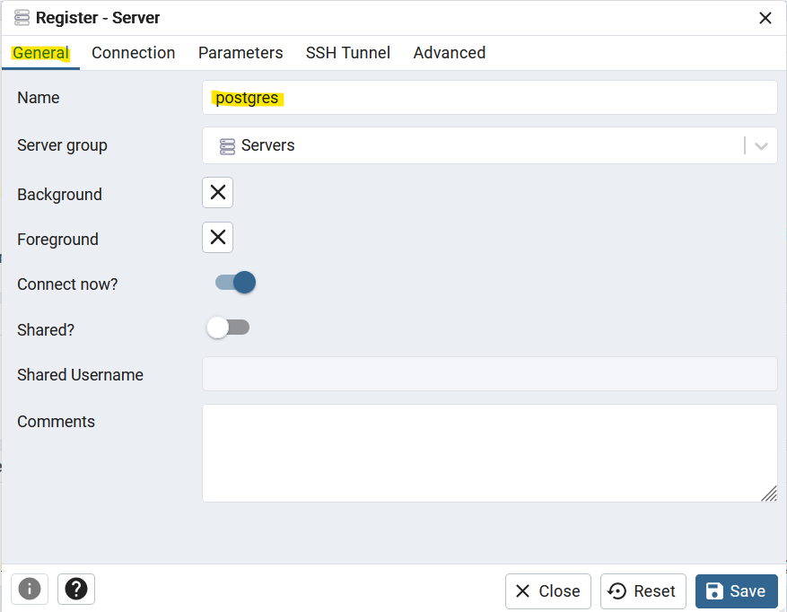
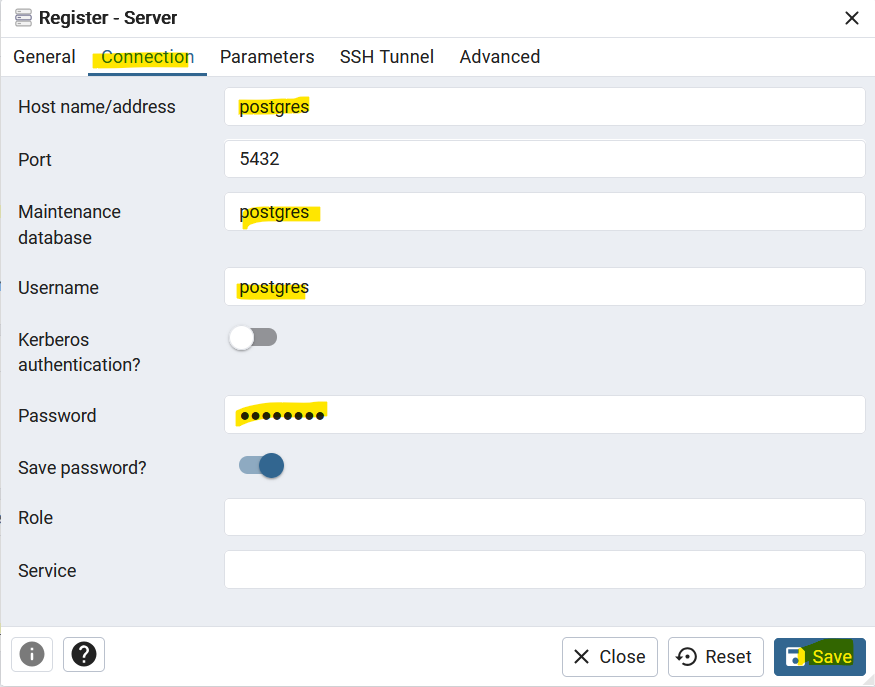
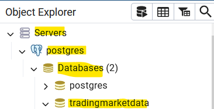
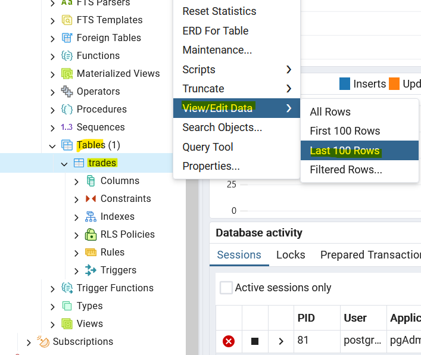

# Simple Apache Kafka Cluster

This project provides a basic setup for an Apache Kafka Cluster, including an Apache Kafka broker, Zookeeper, a producer, and a consumer. The Kafka broker and Zookeeper run inside Docker containers, while the producer and consumer interact with Kafka on the local machine.

## Project Structure

1. **Apache Kafka Broker 1**: The Kafka broker runs inside a Docker container.
2. **Apache Kafka Broker 2**: Another Kafka broker, runs inside a Docker container.
3. **Apache Kafka Broker 3**: Another Kafka broker, runs inside a Docker container.
2. **Zookeeper**: Zookeeper, which is essential for Kafka coordination, also runs inside a Docker container.
3. **PostgreSQL**: The PostgreSQL server runs inside a Docker container.
4. **PGAdmin**: The PGAdmin, to access PostgreSQL database, runs inside a Docker container.
3. **Redis**: Redis Server, as Cache, runs insode a Docker container.
6. **Redis-insight**: Redis-insight, for visualize data for Redis.
5. **Producer-crypto**: A Python script that Extract some Crypto Data as messages for Kafka, runs inside a Docker container.
6. **Producer-forex**: A Python script that Extract some Forex Data as messages for Kafka, runs inside a Docker container.
7. **Consumer 1**: A Python script that consumes messages from Kafka, and Load the data to database.
8. **Consumer 2**: A Python script that consumes messages from Kafka, and Load the data to database.
9. **Consumer 3**: A Python script that consumes messages from Kafka, and Load the data to database.


## How to Run

Follow these steps to set up and run the Kafka Cluster:

1. **Clone the Repository**:
   - Clone the repository:
   ```bash
   git clone https://github.com/karrabi/Samplate.git
   cd Samplate/StreamingForexDataWithApacheKafka
   ```


2. **Setup Project**:
   - Open a command prompt inside *Samplate/StreamingForexDataWithApacheKafka* folder.
   - Run the following command to start the Kafka broker and Zookeeper containers:
     ```bash
     docker compose up
     ```

3. **Connect to Redis**:
   - Open a browser in your local machine
   - Go to http://localhost:5040
   - inside Redis-insight resigter Redis database as follow:





4. **Connect to Database**:
   - Open a browser in your local machine
   - Go to http://localhost:5050/login
   - Enter postgres username and password as is in docker-compose.yaml file and connect to PGAdmin
   - inside PGAdmin resigter postgres server as follow:







5. **Stop and Clean the environment**:
   - Open a command prompt inside the project folder.
   - Run the following command to stop the Kafka broker and Zookeeper containers:
     ```bash
     docker-compose down
     ```
